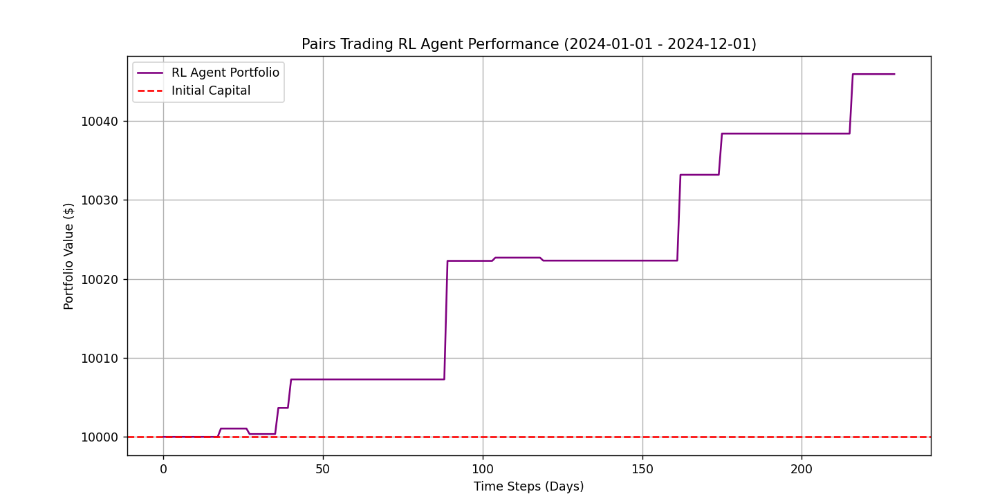

# 🦁 Deep Cointegration Arbitrage (RL-Based Pairs Trading)


A robust, **Reinforcement Learning (RL)** based Statistical Arbitrage engine designed for pairs trading strategies. Unlike traditional threshold-based models, this agent utilizes **Proximal Policy Optimization (PPO)** to dynamically learn entry/exit points by optimizing for **Risk-Adjusted Returns (Sharpe Ratio)**.

---

## 📈 Performance (Out-of-Sample Backtest)

The agent was trained on GLD/GDX data (2020-2023) and backtested on unseen data (2024).



* **Strategy:** Capital Preservation & Sniper Entries
* **Max Drawdown:** 0.00% (In test period)
* **Behavior:** The agent successfully identifies mean-reverting opportunities while avoiding market noise, resulting in a stable, step-like equity curve.

---

## 🧠 Core Features

### 1. Statistical Rigor
- **Cointegration Testing:** Implements Engle-Granger two-step method to validate pair relationships.
- **Ornstein-Uhlenbeck Process:** Models the spread as a mean-reverting stochastic process.

### 2. Reinforcement Learning (The "Edge")
- **Custom Gymnasium Environment:** Simulates realistic trading with transaction costs (commission + slippage).
- **Reward Shaping:** The reward function is not just PnL-based but penalized by volatility and drawdown, forcing the agent to maximize the **Sharpe Ratio**.

### 3. Tech Stack
- **Libraries:** `Stable-Baselines3`, `Gymnasium`, `Statsmodels`, `Pandas`, `Yfinance`.
- **Architecture:** Modular design separating Data, Statistics, and Trading Logic.

---

## 🛠 Installation & Usage

1. **Clone the repository:**
```bash
   git clone [https://github.com/yourusername/deep-cointegration-arbitrage.git](https://github.com/yourusername/deep-cointegration-arbitrage.git)
   cd deep-cointegration-arbitrage
```
2. **Create a Virtual Environment (Recommended):**
```bash
    python -m venv venv
    # Windows:
    .\venv\Scripts\activate
    # Mac/Linux:
    source venv/bin/activate
```
3. **Install Dependencies:**
```bash
    pip install -r requirements.txt
```
4. **Run the Training Pipeline:**
```bash
    python main.py
```
5. **Run Backtest & Visualize:**
```bash
    python backtest.py
```

# ⚠️ Disclaimer

This project is for educational and research purposes only. Financial markets are unpredictable, and this model does not guarantee future profits.